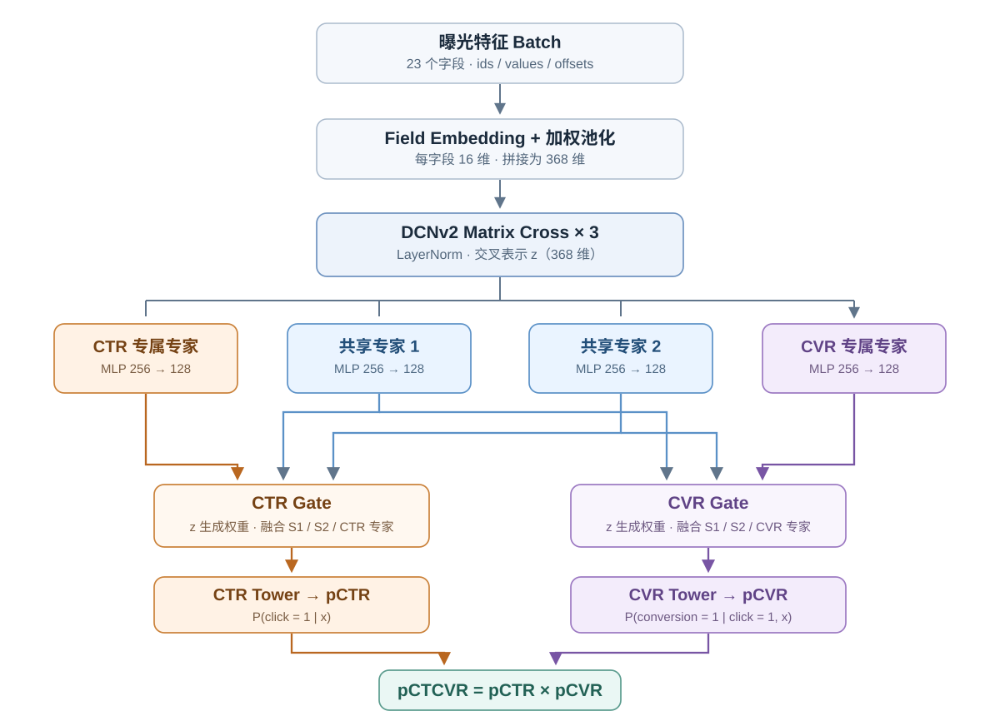
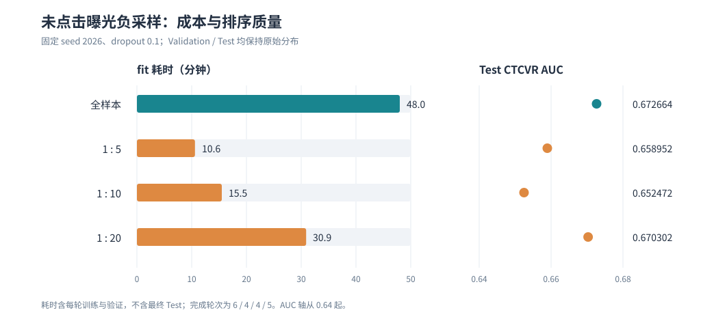
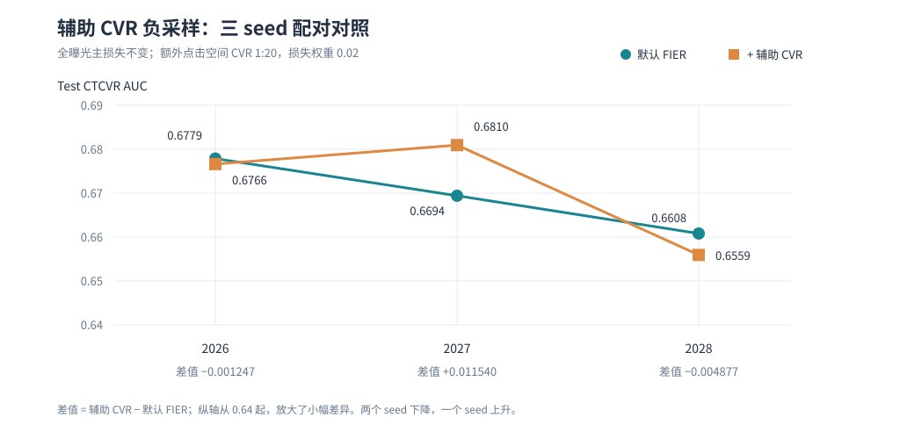

# FIER：广告点击与转化联合预估的离线精排实践

广告精排需要判断一次曝光能否带来点击，以及点击后是否产生转化。本项目基于
[Ali-CCP](https://tianchi.aliyun.com/dataset/408) 原始曝光数据，构建从流式预处理、
稀疏特征编码到 CTR/CVR/CTCVR 训练、评估与概率校准的完整离线流程。
核心方案 FIER（Feature Interaction and Expert Routing）以 DCNv2 显式特征交叉和
PLE 任务专家路由为主体，结合 ESMM 全曝光监督，联合预估 CTR、点击后 CVR 与 CTCVR。
项目通过同条件对照、负采样和多随机种子实验检验这一方案的收益与局限。

## 1. 问题定义

广告行为通常遵循“曝光 → 点击 → 转化”。对于当前曝光特征 $x$：

$$
p_{CTR}=P(click=1\mid x),\quad
p_{CVR}=P(conversion=1\mid click=1,x),\quad
p_{CTCVR}=P(click=1,conversion=1\mid x)=p_{CTR}p_{CVR}.
$$

CTR 和 CTCVR 面向全部曝光评估；点击后 CVR 只在已点击曝光上评估。
转化正例远少于点击正例。如果只在点击样本上训练 CVR，模型面对的是经过点击筛选的
特征分布，与对全部曝光做排序的场景不同，容易出现样本选择偏差。FIER 使用 CTR 与
CTCVR 的全曝光监督缓解这一问题，但不保证消除所有估计偏差。

## 2. 数据与处理链路

```text
sample_skeleton（曝光、标签、sample 侧特征）
             + common_features（用户及历史特征）
             → 按 common_feature_id 关联
             → 流式扫描、清理不符合点击→转化漏斗的标签
             → 仅用训练集建立逐字段词表（PAD=0、UNK=1）
             → sample/common 配对 Parquet 分片
             → Arrow 列式 Batch，在分片内按 common_index 关联
             → ids / values / offsets → GPU 模型
```

配对分片对公共特征去重，不在每条曝光中重复展开长用户历史。模型接收 23 个匿名稀疏字段；
不根据字段编号猜测真实业务语义。预处理及 DataLoader 入口见[运行文档](docs/usage.md)。

| 划分 | 有效曝光数 | 来源 |
|---|---:|---|
| Train | 42,299,905 | 官方 Train |
| Validation | 4,263,506 | 官方 Test 剩余样本的哈希划分结果 |
| Test | 38,353,110 | 官方 Test 剩余样本的哈希划分结果 |

具体做法是：先从**官方 Test** 排除开发期实验用过的前 400K 条，再以固定种子对
剩余样本的 `sample_id` 做稳定哈希，约 10% 分入 Validation，其余分入本项目的 Test。
原始文件没有显式时间戳，因而这里**不是时间切分**。
词表只拟合 Train，验证与测试中的未见 token 映射为 UNK。

## 3. FIER 方案结构

```text
23 个字段 → 16 维 Embedding / 字段加权均值 → 拼接输入 x₀
                                            ↓
                                3 层 DCNv2 Matrix Cross
                                            ↓
                                        LayerNorm
                                            ↓
                          单层 PLE 式专家与任务 Gate
                    ┌───────────────────────┴───────────────────────┐
             共享专家 ×2 + CTR 专家 ×1                    共享专家 ×2 + CVR 专家 ×1
                    ↓                                               ↓
              CTR Tower → pCTR                                 CVR Tower → pCVR
                    └───────────────────────┬───────────────────────┘
                                        pCTCVR = pCTR × pCVR
```

两侧使用的是**同一组**共享专家，并非各自复制两份。下图将 2 个共享专家、
1 个 CTR 专家和 1 个 CVR 专家分别画出，展示它们如何进入两个 Gate：



DCNv2 Cross 学习显式特征交互；两个任务的 Gate 分别融合共享专家与本任务专家。
这里实现的是**单层** PLE 式路由，而非原论文的完整多层结构。两个输出满足
`pCTCVR = pCTR × pCVR`，默认在全部曝光上优化：

```text
Loss = BCE(click, pCTR) + BCE(click × conversion, pCTCVR)
```

网络前向可使用 AMP，损失计算保持 FP32。DCNv2、PLE 与 ESMM 均为已有方法；
本项目的重点是将它们接入同一数据和评估流程，并验证组合效果。

## 4. 实验协议

主方案的默认配置来自 [`configs/dcn_ple_esmm.yaml`](configs/dcn_ple_esmm.yaml)；
组件对照和增强实验的变更在对应小节注明，不能把它们都视为下表的默认运行。

| 实验项 | FIER 默认配置 |
|---|---|
| 数据与输入 | §2 固定划分；23 个匿名稀疏字段；每字段 16 维 Embedding，历史字段按特征值加权均值池化 |
| 交叉与专家 | DCNv2 Cross 3 层并使用 LayerNorm；共享专家 2 个，CTR/CVR 各 1 个任务专家；专家 MLP `256 → 128`，任务塔 `64` |
| 监督与采样 | 全曝光 `CTR BCE + CTCVR BCE`，权重 `1 : 1`；不做未点击曝光负采样，也不加辅助 CVR 损失 |
| 优化与正则 | Adam，学习率 `1e-3`，weight decay `1e-6`；网络 dropout `0.2`，Gate Dropout `0`；梯度范数裁剪 `5` |
| 数据吞吐 | Arrow 列式 Batch，batch size `8192`，DataLoader workers `8`，AMP 开启 |
| 训练与选模 | 最多 `10` 个 epoch；Validation CTCVR AUC 提升须超过 `1e-4`，连续 `3` 轮未提升则早停，保存最佳 `best.pt` |
| 重复实验 | 配置默认 seed `2026`；稳健性对照另用 `2027 / 2028`，数据划分不随训练 seed 改变 |

CVR 指标只在点击样本上计算，CTR/CTCVR 指标在全部曝光上计算；GAUC 按符合计算条件的
用户曝光数加权。Test 不参与选轮次或校准器拟合。以下组件对照统一使用 seed 2026、
`dropout=0.1`、`gate_dropout=0` 和完整曝光训练；它与上表的默认 `dropout=0.2`
**不是同一配置**。后续 Dropout 对照保持其余设置不变。

结果来自实际全量实验。[实验汇总 CSV](results/experiment_summary.csv) 记录运行名、
配置、耗时和测试指标；除专门注明的先验修正与校准结果外，下文 Test 指标均使用
模型的未校准输出。历史探索已多次查看 Test，因此这些对照是回顾性分析，
不能视为完全未触碰测试集的盲测结论。

## 5. 核心结果

### 同条件组件对照（Test；dropout=0.1，seed=2026）

| 方案 | 训练目标 | CTR AUC | CVR AUC | CTCVR AUC | CTCVR GAUC | CTCVR LogLoss |
|---|---|---:|---:|---:|---:|---:|
| ESMM | CTR + 全曝光 CTCVR | 0.622897 | 0.669692 | 0.653902 | 0.615818 | **0.001994** |
| DCNv2 + ESMM | CTR + 全曝光 CTCVR | 0.623338 | 0.677804 | 0.664705 | 0.629210 | 0.002058 |
| PLE + ESMM | CTR + 全曝光 CTCVR | 0.624086 | 0.688508 | 0.667359 | **0.629610** | 0.002012 |
| **FIER（DCNv2 + PLE + ESMM）** | CTR + 全曝光 CTCVR | **0.625479** | **0.691803** | **0.672664** | 0.623419 | 0.002014 |

四个方案使用同一 ESMM 监督口径，因此可以分别观察 DCNv2 特征交叉和 PLE
专家路由的增量。相比 ESMM，单独加入 DCNv2 和 PLE 使 CTCVR AUC 分别提高
`0.010803` 和 `0.013457`；同时使用两者的 FIER 提高 `0.018762`，取得表中最高的
CTR、CVR 和 CTCVR 全局 AUC。但 FIER 的 CTCVR GAUC 低于两个单组件方案，
LogLoss 也没有超过 ESMM：这组单 seed 结果支持“全局排序改善”，不支持
“用户内排序和概率质量同步改善”。

### Dropout 与随机种子

FIER 分别以 0.1 和 0.2 跑了相同的三个 seed。下表 Test 栏为 CTCVR AUC，
“±”后是三个 seed 的**样本标准差**；Validation 栏为各 seed 最优轮次 AUC 的均值。

| Dropout | Validation AUC 均值 | Test：2026 | Test：2027 | Test：2028 | Test 均值 ± 标准差 |
|---:|---:|---:|---:|---:|---:|
| 0.1 | 0.655295 | 0.672664 | 0.668533 | 0.655896 | 0.665698 ± 0.008736 |
| 0.2 | 0.656173 | 0.677874 | 0.669411 | 0.660807 | 0.669364 ± 0.008533 |

相同 seed 的 Test AUC 配对差值（0.2 减 0.1）为 `+0.005210 / +0.000878 / +0.004911`，
但 Validation 仅两个 seed 提升，均值增加 `0.000878`。因此保留 `dropout=0.2`
作为当前默认值，同时只把三 seed 结果视为有限的稳定性检查，不宣称显著提升。

默认 FIER（`dropout=0.2`）的最终三 seed 结果如下。每个 seed 都独立依据自己的
Validation CTCVR AUC 选择 checkpoint，表中 Test 指标来自未校准输出。

| Seed | Validation CTCVR AUC | Test CTR AUC | Test CVR AUC | Test CTCVR AUC | Test CTCVR GAUC | Test CTCVR LogLoss |
|---:|---:|---:|---:|---:|---:|---:|
| 2026 | 0.660525 | 0.627595 | 0.692857 | 0.677874 | 0.622393 | 0.002049 |
| 2027 | 0.657509 | 0.623789 | 0.689646 | 0.669411 | 0.624514 | 0.002007 |
| 2028 | 0.650486 | 0.628930 | 0.671923 | 0.660807 | 0.621382 | 0.002102 |
| 均值 ± 样本标准差 | — | 0.626771 ± 0.002668 | 0.684809 ± 0.011274 | 0.669364 ± 0.008533 | 0.622763 ± 0.001599 | 0.002053 ± 0.000048 |

CTCVR AUC 的三个 Test 值相差最多 `0.017067`，比许多单次改动的提升更大；
因此后文优先报告配对 seed，而不凭某一个最好 checkpoint 下结论。
下文概率校准使用 seed 2026 的运行
`dcn_ple_esmm_aliccp_full_dropout_02_20260915_154204`。

## 6. 训练策略与增强实验分析

以下按“样本效率 → 稀疏转化监督 → 路由与历史建模 → 概率质量”的顺序分析。
排序 AUC、用户内 GAUC、概率 LogLoss/ECE 衡量不同性质；取舍优先依据
Validation CTCVR AUC 与多 seed 稳定性，不用校准后的低 LogLoss 代替排序收益。

### 未点击曝光负采样

以下比较固定 `dropout=0.1`、seed 2026；Validation/Test 始终保持原分布。
只对训练集的未点击曝光做均匀负采样，所有点击曝光保留。

| 训练曝光 | 完成轮次 | `fit` 耗时（含每轮验证） | Test CTCVR AUC | 原始 CTCVR LogLoss | 先验修正后 CTCVR LogLoss |
|---|---:|---:|---:|---:|---:|
| 全样本 | 6 | 2,880 s | **0.672664** | **0.002014** | — |
| 点击 : 未点击 = 1 : 5 | 4 | 636 s | 0.658952 | 0.003423 | 0.002115 |
| 点击 : 未点击 = 1 : 10 | 4 | 932 s | 0.652472 | 0.002346 | 0.002044 |
| 点击 : 未点击 = 1 : 20 | 5 | 1,855 s | 0.670302 | 0.002071 | 0.002078 |



1:5 的记录耗时比全样本少约 `78%`，但 AUC 低 `0.013712`；1:20 的 AUC 仅低
`0.002362`，记录耗时仍约为全样本的 `64%`。1:10 没有呈现单调收益，不能据比例
推断排序质量。`fit` 耗时包含每轮训练、验证和 checkpoint 保存，不含最终 Test 与
另行校准；完成轮次也不同，机器和 I/O 条件亦有差异，不能把全部时间差归因于采样。
均匀负采样改变了类别先验，先验修正通常可调整概率尺度，却**不保证**每次都改善
LogLoss（如 1:20），更不能恢复采样训练已经失去的排序信息。默认保留全样本训练。

### 辅助 CVR 负采样：FIER 的增强尝试

在默认的全曝光 CTR/CTCVR 损失之外，额外加入权重 0.02 的点击空间 CVR 损失：
保留点击后转化正例，每个 batch 随机选取约 20 倍于正例数的点击未转化样本。
**主损失仍使用全部曝光**，因此这里的 1:20 与上文的未点击曝光降采样不同。
对照固定 `dropout=0.2`、`gate_dropout=0`，每个 seed 均按 Validation CTCVR AUC
选取最优 checkpoint。表中箭头左侧是 FIER 默认方案，右侧是加入辅助损失后的结果；
Test AUC 使用未校准输出，Platt 只用于另行比较概率质量。

| Seed | Validation CTCVR AUC | Test CTCVR AUC | 原始 Test CTCVR LogLoss | Platt 后 Test CTCVR LogLoss |
|---:|---:|---:|---:|---:|
| 2026 | 0.660525 → 0.665072 | 0.677874 → 0.676627 | 0.002049 → 0.002352 | 0.00196986 → 0.00196930 |
| 2027 | 0.657509 → 0.662757 | 0.669411 → 0.680951 | 0.002007 → 0.002416 | 0.00197427 → 0.00196681 |
| 2028 | 0.650486 → 0.644539 | 0.660807 → 0.655930 | 0.002102 → 0.003177 | 0.00197959 → 0.00198387 |
| 三 seed 均值 | 0.656173 → 0.657456 | 0.669364 → 0.671170 | 0.002053 → 0.002648 | 0.00197458 → 0.00197333 |



增强方案的 Test AUC 均值提高 0.001806，但三个 seed 中有两个下降；其 Test AUC
样本标准差也从 0.008533 增至 0.013374。未校准 LogLoss 在三个 seed 上均变差；
两组使用相同的 Validation 拟合 Platt 后，平均 LogLoss 基本持平。
辅助损失引入额外采样和权重参数，却尚未表现出稳定的排序收益，因此**不进入默认 FIER**，
作为一次有实测结果的增强尝试保留。校准能修正概率尺度，不代表能补回排序损失；
这些 Test 对照也属于多次探索后的回顾性分析。

### Gate Dropout 与历史注意力

下表均固定 `dropout=0.2`、seed 2026、完整曝光训练，每行只改动所列模块：

| 设置 | 点击空间 CVR AUC | CTCVR AUC | CTCVR GAUC | CTCVR LogLoss |
|---|---:|---:|---:|---:|
| FIER 默认 | 0.692857 | **0.677874** | 0.622393 | 0.002049 |
| + Gate Dropout 0.1 | 0.676000 | 0.665352 | **0.628898** | **0.002035** |
| + Target-aware 历史注意力 | 0.679687 | 0.668247 | 0.619018 | 0.002080 |

Gate Dropout 提高 GAUC，但降低全局 CTCVR AUC；历史注意力也未改善主指标。
因此默认配置不加入这两项。它们目前只有单 seed 的同条件对照，不能据此判断稳定收益。

### 概率校准

对 CTR/CVR 分别在 Validation 拟合 Platt Scaling 与 Isotonic Regression，
再相乘得到校准后的 CTCVR；Test **只用于评估**。下表来自上述 FIER 0.2、seed 2026
运行的 `evaluation_calibrated_multitask.json`，ECE 使用 20 个等频分箱：

| CTCVR 概率 | Val LogLoss | Val ECE | Test AUC | Test LogLoss | Test ECE |
|---|---:|---:|---:|---:|---:|
| 未校准 | 0.002070 | 0.00012058 | **0.677874** | 0.002049 | 0.00011723 |
| Platt | 0.001978 | **0.00003690** | 0.675274 | **0.001970** | **0.00001990** |
| Isotonic | **0.001975** | 0.00003722 | 0.672833 | 0.001973 | 0.00002562 |

以 **Validation ECE** 为当前报告的选择口径，概率输出暂选 Platt：它在该口径
略优于 Isotonic，Test LogLoss/ECE 也更低；若以 Validation LogLoss 为标准，
则应选 Isotonic。两种方法差距很小，且当前 Validation 同时承担校准器拟合与方法比较，
选择结果不是独立验证的结论；更严格的实验应另留校准方法选择集。
分头校准再相乘不保证保持 CTCVR 排序，两种方法的 Test AUC 均低于未校准预测。
相对未校准输出，本次 Platt 的 Test LogLoss 约下降 `3.8%`、ECE 约下降 `83%`，
而 AUC 下降 `0.002600`；这是概率质量与排序指标应分别报告的直接例子。
因此排序评估保留原始分数；如需概率输出，本报告暂推荐 Platt。评估程序仍保存
两种校准结果，并未自动部署其中一种。下图只展示原始概率与 Platt 的 Test 分箱曲线；
校准器没有使用 Test 标签拟合。


## 7. 单机推理与动态微批处理

训练完成后可将 `best.pt`、训练词表与 Validation 拟合的 Platt 参数导出为不可变
TorchScript artifact，并由 FastAPI `/rank` 接口接收一个用户及其候选集合：

```text
HTTP 请求 → 原始 token 校验与词表编码 → 有界异步队列
         → 最多等待 2 ms，合并不超过 8 个请求 / 256 个候选
         → 一次 TorchScript forward → 按原请求切分 → 校准（可选）→ 排序返回
```

动态队列对每个请求独立校验，非法请求不会使同批其他请求失败。下面是在同一台单卡
服务器、同一导出模型和同一 Test 请求集上的离线压测；每组执行 500 个请求并重复
3 次，表中为中位数。`P95` 是客户端端到端 HTTP 延迟；“无合并”仍经过相同队列与
推理路径，但设置 `max_batch_requests=1`，用于隔离真正的多请求合并收益。

| 每请求候选数 | 并发 | 无合并 QPS | 动态合批 QPS | 无合并 P95 | 动态合批 P95 | 平均请求/模型 Batch |
|---:|---:|---:|---:|---:|---:|---:|
| 1 | 8 | 61.73 | 130.63 | 183.86 ms | 113.26 ms | 4.03 |
| 8 | 8 | 30.83 | 74.76 | 325.49 ms | 164.02 ms | 4.00 |
| 32 | 8 | 15.80 | 33.98 | 602.92 ms | 306.23 ms | 3.97 |

在 8/32 候选场景，候选打分吞吐分别约从 `247/506` 提升到 `598/1,087` 条/秒；
低并发无法形成合批，还会承担等待窗口开销，因此服务优化的是并发吞吐而非所有流量
形态下的单请求延迟。原始 16 个 Test 用户模板中有 7 个在人工扩展到 32 个候选后
超过 `16,384` 个特征 token 的接口安全上限；表中固定使用其余 9 个模板，不能视为
完整用户总体或线上生产性能。导出、调用、压测及统计口径见[运行文档](docs/usage.md)。

## 8. 局限

- 本项目只有离线曝光日志；没有真实 bid/value、线上流量或真实 A/B 实验。
- 哈希划分保证运行间一致，不能替代时间切分；正式评估已排除开发期接触过的样本。
- 项目探索已多次查看 Test；Dropout 与辅助 CVR 做了三个 seed，其余不少对照仍为单次运行，不能宣称统计显著或严格盲测。
- 当前校准器在 Validation 上拟合并以同一划分比较方法，尚缺独立的校准方法选择集。
- 模型使用单层 PLE 式专家路由；方法模块源自已有研究，当前实验不证明组合在其他数据集上普适。
- `/rank` 是单机离线演示，没有鉴权、流量治理和线上 A/B 实验；Serving 压测只覆盖经过 token 上限预检查的 9 个 Test 用户模板。

## 9. Quick Start

准备 Python 3.12、与驱动兼容的 PyTorch/CUDA 环境以及官方 Ali-CCP 原始文件。
从数据处理到 FIER 训练、评估、断点续训、模型导出和单机压测的输入、命令及输出，见
**[完整程序说明与运行命令](docs/usage.md)**。

## 10. 方法来源

- [DCN V2：显式特征交叉](https://arxiv.org/abs/2008.13535)
- [PLE：共享与任务专家](https://doi.org/10.1145/3383313.3412236)
- [ESMM：全曝光空间点击与转化建模](https://arxiv.org/abs/1804.07931)

以上论文提供方法基础；本仓库的指标仅对应本仓库记录的 Ali-CCP 离线实验。
