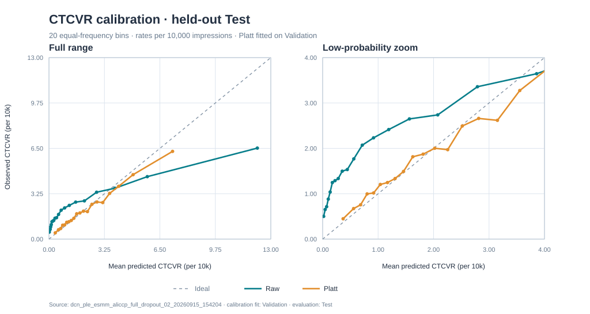

# FIER：基于特征交叉与漏斗建模的广告 CTR/CVR 精排

FIER（**Funnel-aware Interaction and Expert Routing**）是本项目对最终方案的称呼：
在 [Ali-CCP](https://tianchi.aliyun.com/dataset/408) 曝光日志上，将显式特征交叉、
任务专家路由与全曝光空间的 CTR/CTCVR 训练目标用于联合预估点击和转化。
代码与历史实验仍使用 `dcn_ple_esmm` 标识。项目重点是可复现的**离线精排流程与实验取舍**，
不是提出新的基础模型，也不声称具有真实线上流量或 A/B 实验结果。

## 1. 问题定义

广告行为遵循“曝光 → 点击 → 转化”的漏斗。对于当前曝光特征 $x$：

$$
p_{CTR}=P(click=1\mid x),\quad
p_{CVR}=P(conversion=1\mid click=1,x),\quad
p_{CTCVR}=P(click=1,conversion=1\mid x)=p_{CTR}p_{CVR}.
$$

CTR 和 CTCVR 面向全部曝光评估；点击后 CVR 只在已点击曝光上评估。
转化正例远少于点击正例，直接只用点击样本训练 CVR 还会使训练样本空间与曝光排序时的
使用空间不同。FIER 因此采用 ESMM 式的 CTR 与 CTCVR 全曝光监督；它缓解上述问题，
但不保证消除所有 CVR 估计偏差。

## 2. 数据与处理链路

```text
sample_skeleton（曝光、标签、sample 侧特征）
             + common_features（用户及历史特征）
             → 按 common_feature_id 关联
             → 流式扫描、清理不符合点击→转化漏斗的标签
             → 仅用训练集建立逐字段词表（PAD=0、UNK=1）
             → sample/common 配对 Parquet 分片
             → Arrow 列式 Batch，在分片内按 common_index 关联
             → ids / values / offsets → GPU 模型
```

配对分片对公共特征去重，不在每条曝光中重复展开长用户历史。模型接收 23 个匿名稀疏字段；
不根据字段编号猜测真实业务语义。预处理及 DataLoader 入口见[运行文档](docs/usage.md)。

| 划分 | 有效曝光数 | 来源 |
|---|---:|---|
| Train | 42,299,905 | 官方 Train |
| Validation | 4,263,506 | 未使用的官方 Test，稳定哈希划分 |
| Test | 38,353,110 | 未使用的官方 Test，稳定哈希划分 |

原始文件没有显式时间戳，因而这里**不是时间切分**。官方 Test 的前 400K 条曾用于开发期实验，
正式 Validation/Test 将其排除；剩余数据按固定种子对 `sample_id` 做稳定哈希划分。
词表只拟合 Train，验证与测试中的未见 token 映射为 UNK。

## 3. FIER 模型

```text
23 个字段 → 16 维 Embedding / 字段加权均值 → 拼接输入 x₀
                                            ↓
                                3 层 DCNv2 Matrix Cross
                                            ↓
                                        LayerNorm
                                            ↓
                          单层 PLE 式专家与任务 Gate
                    ┌───────────────────────┴───────────────────────┐
             共享专家 ×2 + CTR 专家 ×1                    共享专家 ×2 + CVR 专家 ×1
                    ↓                                               ↓
              CTR Tower → pCTR                                 CVR Tower → pCVR
                    └───────────────────────┬───────────────────────┘
                                        pCTCVR = pCTR × pCVR
```

DCNv2 Cross 显式学习稀疏字段交互；共享与任务专属专家让 CTR/CVR 使用不同的信息组合；
漏斗约束使 CTCVR 与两个输出保持概率关系。这里实现的是**单层** PLE 式路由，
不把它描述成原论文的完整多层结构。默认损失权重均为 1：

$$
\mathcal{L}=\operatorname{BCE}(y_{click},p_{CTR})+
\operatorname{BCE}(y_{click}y_{conversion},p_{CTCVR}).
$$

损失在 FP32 中计算，即使网络前向使用 AMP。FIER 是对既有方法的工程组合，
其价值需要由下面的对照、稳定性与概率评估支撑，而不是由模块数量决定。

## 4. 实验协议

默认主模型使用完整曝光训练、`dropout=0.2`、`gate_dropout=0`、batch size 8192，
最多 10 个 epoch，早停 patience 为 3。按 **Validation CTCVR AUC** 保存 `best.pt`，
再在 Test 上报告最终指标；Test 不参与选轮次或拟合校准器。CVR AUC/LogLoss 的样本空间
仅为已点击曝光，CTCVR 指标的样本空间为全部曝光，GAUC 按有效用户的曝光数加权。

下表均来自实际全量实验。[实验汇总 CSV](results/experiment_summary.csv) 记录运行名、种子、
超参数、训练耗时和测试指标；每个本地 run 还保存解析后的配置快照及详细指标。

## 5. 核心结果

### 主线组件对照（Test）

| 方案 | 训练目标 | Dropout | CTR AUC | CVR AUC | CTCVR AUC | CTCVR GAUC | CTCVR LogLoss |
|---|---|---:|---:|---:|---:|---:|---:|
| DCNv2 + PLE | CTR + 点击空间 CVR | 0.1 | 0.619646 | 0.676244 | 0.662116 | 0.625034 | 0.002168 |
| PLE + ESMM | CTR + 全曝光 CTCVR | 0.1 | 0.624086 | 0.688508 | 0.667359 | **0.629610** | **0.002012** |
| **FIER** | CTR + 全曝光 CTCVR | 0.2 | **0.627595** | **0.692857** | **0.677874** | 0.622393 | 0.002049 |

这些是组件方案的**实测对照**，不是严格单变量消融：FIER 的 dropout 与另外两行不同。
FIER 在这次运行的全局 CTCVR AUC 最高，但 PLE + ESMM 的 CTCVR GAUC 和 LogLoss 更好，
因此不能说它在所有指标上领先。FIER 行对应
`dcn_ple_esmm_aliccp_full_dropout_02_20260915_154204`，seed 为 2026。

同一 FIER 配置在 seed 2026/2027/2028 的 Test CTCVR AUC 分别为
`0.677874 / 0.669411 / 0.660807`，均值 ± 样本标准差为 **`0.669364 ± 0.008533`**。
单次最高值不等于稳定收益；不同方案若要声称显著优劣，还需要匹配配置与更多随机种子。

## 6. 关键取舍

### 未点击曝光负采样

以下对照固定 `dropout=0.1`、seed 2026；所有验证与测试样本仍保持原分布：

| 训练曝光 | 训练阶段记录耗时 | Test CTCVR AUC |
|---|---:|---:|
| 全样本 | 2,880 s | **0.672664** |
| 点击 : 未点击 = 1 : 5 | 636 s | 0.658952 |
| 点击 : 未点击 = 1 : 20 | 1,855 s | 0.670302 |

负采样减少训练样本，耗时也受运行机器与 I/O 状态影响，表中不将时间差解释为纯算法加速。
均匀采样改变类别先验：先验修正与后续校准能改善概率尺度，却不能恢复已经丢失的排序信息。
因此 FIER 默认仍采用全样本。

### 辅助 CVR 与 Gate Dropout

固定 `dropout=0.2`、seed 2026 时，主模型 Test CTCVR AUC 为 `0.677874`；
增加权重 `0.02` 的点击空间辅助 CVR 采样损失（1:20）后为 `0.676627`，
设置 `gate_dropout=0.1` 后为 `0.665352`。二者未进入默认方案。
截至本版本仅核对了该辅助损失的 seed 2026 结果；其他 seed 未核实前，不据此作稳定性结论。

### 概率校准

在 Validation 上拟合 CTR/CVR 的 Platt 校准器，在 Test 上重新计算 CTCVR。
下表与图均来自上述 FIER seed 2026 运行的
`evaluation_calibrated_multitask.json`，使用 20 个等频分箱：

| Test CTCVR | AUC | LogLoss | ECE |
|---|---:|---:|---:|
| 原始预测 | **0.677874** | 0.002049 | 0.000117 |
| Platt 后 | 0.675274 | **0.001970** | **0.000020** |



Platt 改善了这一运行的概率误差，但对 CTR/CVR 两个输出分别校准再相乘后，CTCVR 排序
并非严格不变，AUC 略降。需要排序时应同时关注原始分数的 AUC；需要概率参与价值计算时
再考虑校准后的输出。

## 7. 局限

- 本项目只有离线曝光日志；没有真实 bid/value、线上流量或真实 A/B Test。
- 哈希划分保证运行间一致，不能替代时间切分；正式评估已排除开发期接触过的样本。
- 多数组件和采样实验只有单次运行；三 seed 波动不小，不将小幅提升表述为统计显著。
- 模型使用单层 PLE 式专家路由；FIER 是项目命名，不代表发表或首创的新架构。

## 8. Quick Start

准备 Python 3.12、与驱动兼容的 PyTorch/CUDA 环境以及官方 Ali-CCP 原始文件。
从数据处理到 FIER 训练、评估和断点续训的输入、命令及输出，见
**[完整程序说明与运行命令](docs/usage.md)**。

## 9. 方法来源

- [DCN V2：显式特征交叉](https://arxiv.org/abs/2008.13535)
- [PLE：共享与任务专家](https://doi.org/10.1145/3383313.3412236)
- [ESMM：全曝光空间点击与转化建模](https://arxiv.org/abs/1804.07931)

以上论文提供方法基础；本仓库的指标仅对应本仓库记录的 Ali-CCP 离线实验。
